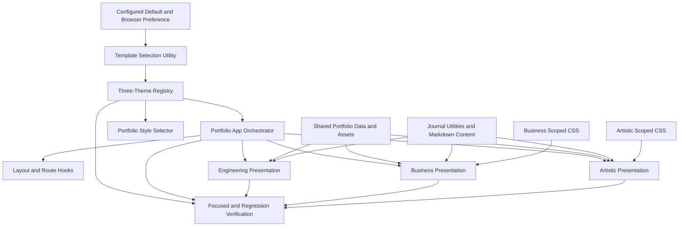

# Component Dependencies - Sleek Three-Theme Redesign

## Dependency Flow

### Text Alternative

The configured default and browser preference flow through template validation into the three-theme registry and App. App coordinates existing layout and route hooks and renders Engineering, Business, or Artistic. The registry supplies selector metadata. All presentations read shared data, assets, and journal sources. Business and Artistic each consume only their own scoped CSS. Focused and regression checks observe the registry, App, and all three presentations.

## Dependency Matrix

| Consumer                     | Template contracts | Registry/selection | Shared data | Journal utilities | Shared behavior/UI | Theme CSS          |
| ---------------------------- | ------------------ | ------------------ | ----------- | ----------------- | ------------------ | ------------------ |
| `PortfolioApp`               | Required           | Required           | Navigation  | Route parsing     | Layout hooks       | None               |
| `PortfolioStyleSelector`     | ID                 | Registry metadata  | None        | None              | Chakra menu        | Owning shell       |
| Engineering presentation     | Shell/section maps | Via App            | Required    | Required          | Allowed            | Existing global    |
| Business presentation        | Shell/section maps | Via App            | Required    | Required          | Low-level only     | `business.css`     |
| Artistic presentation        | Shell/section maps | Via App            | Required    | Required          | Low-level only     | `artistic.css`     |
| Business journal page        | Journal props      | Via App            | Post data   | Required          | React Markdown     | `business.css`     |
| Artistic journal page        | Journal props      | Via App            | Post data   | Required          | React Markdown     | `artistic.css`     |
| Focused and regression tests | All public seams   | Required           | Fixtures    | Routes/posts      | Render providers   | Class/token checks |

## Communication Patterns

- **Strategy resolution**: Registry returns a complete typed presentation strategy; App never selects individual Business or Artistic components by condition.
- **Data down**: Theme components import immutable typed data and receive App-owned navigation state through shell props.
- **Events up**: Shell controls call typed App callbacks for navigation, layout, and template selection.
- **Route ownership**: App and existing hooks own hashes; theme sections and journal pages render links but do not own router state.
- **Behavior reuse**: Data, action, media, route, accessibility, and Markdown behavior may be shared.
- **Presentation isolation**: Visible Business and Artistic DOM structures and CSS remain theme-owned and never import Engineering section components.
- **CSS isolation**: Theme files use root-class descendant selectors, decorative layers are non-interactive, and responsive/reduced-motion rules stay inside the owning theme scope.

## Coupling Controls

- `PortfolioTemplateId` is the only theme-ID authority; registry, options, selector icons, source configuration, validators, and tests must compile against it.
- App remains unaware of Business and Artistic component names and content arrangement.
- Business and Artistic may share source data but never import each other's presentation components or CSS.
- Business and Artistic local primitives remain private to their folder.
- Engineering imports and visible component map remain unchanged.
- No Theme component imports `src/data/artistic.ts`; the file remains deleted.
- Complete section-map tests compare each Business and Artistic entry against Engineering component identities and reject shared visible fallbacks.

## Content Validation

| Check                    | Result                                                                      |
| ------------------------ | --------------------------------------------------------------------------- |
| Mermaid syntax           | Node IDs, quoted labels, edges, and all referenced nodes manually validated |
| Mermaid text alternative | Included immediately after the diagram                                      |
| ASCII diagrams           | Not used                                                                    |
| Markdown structure       | Valid code fence, table, headings, and lists                                |

## Extension Compliance

| Extension              | Status   | Rationale                                                                                                    |
| ---------------------- | -------- | ------------------------------------------------------------------------------------------------------------ |
| Security Baseline      | Disabled | Reconfirmed during Requirements Analysis; no enabled security rules apply to dependency design.              |
| Property-Based Testing | Disabled | Reconfirmed during Requirements Analysis; focused deterministic verification remains the approved direction. |
