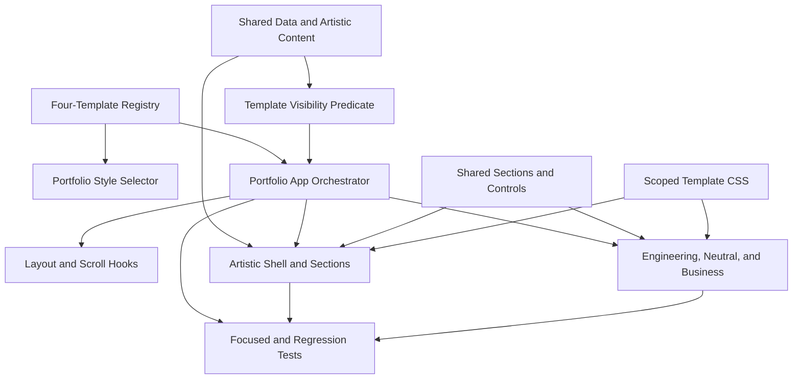

# Component Dependencies - Youthful Themes and Artistic Student Template

## Dependency Flow

### Text Alternative

Shared and Artistic data feed the Artistic components and its visibility predicate. The registry feeds App and the shared selector. App applies visibility, coordinates layout and scroll hooks, and renders either Artistic or an existing template. Shared controls support all templates, scoped CSS styles only its owning template, and tests verify App plus every presentation boundary.

## Dependency Matrix

| Consumer | Contracts | Shared data | Artistic data | Registry | Layout hooks | Shared UI | Scoped CSS |
|---|---|---|---|---|---|---|---|
| `PortfolioApp` | Required | Navigation | No | Required | Required | No | No |
| `ArtisticShell` | Shell props | Profile | No | Via selector | Via callbacks | Required | Artistic only |
| Artistic sections | Section IDs | Required | Required where relevant | No | No | Required | Artistic only |
| Existing templates | Existing contracts | Required | No | Via selector | Via callbacks | Required | Owning template only |
| Visibility predicate | Section ID | Experience and Awards | Activities | No | No | No | No |
| Tests | All public seams | Fixtures | Fixtures | Required | Required | Render targets | Class and browser checks |

## Communication Patterns

- **Data down**: Typed modules are imported by section strategies; components do not mutate content.
- **Events up**: Shell controls call typed App callbacks for navigation, layout, and template selection.
- **Strategy resolution**: Registry metadata selects Shell and section component maps.
- **Visibility filtering**: A pure optional predicate filters global navigation before hooks and rendering receive section IDs.
- **Presentation isolation**: Root template classes own CSS variables and descendant selectors.

## Coupling Controls

- `PortfolioStyleSelector` continues to read registry metadata, so template definitions must avoid module-level side effects.
- Artistic imports shared data directly but existing templates never import Artistic data.
- The optional visibility predicate prevents a breaking contract change for existing templates.
- App remains unaware of Artistic-specific array names; only the Artistic definition owns those visibility rules.
- Section maps remain complete even when navigation hides a section, preserving typed registry completeness.

## Content Validation

| Check | Result |
|---|---|
| Mermaid syntax | All node IDs, edges, and referenced nodes validated |
| Mermaid text alternative | Included |
| ASCII diagrams | Not used |
| Markdown structure | Valid code fence and table |

