# Execution Plan - Remove Artistic Data Module and Simplify README

> **Status: Approved on 2026-08-24.**

## Detailed Analysis Summary

### Transformation Scope

- **Transformation type**: Small brownfield refactor plus user-documentation rewrite.
- **Primary changes**: Remove `src/data/artistic.ts`, preserve its rendered content through an existing appropriate source boundary, update consumers and tests, and simplify the README for non-technical users.
- **Related components**: Portfolio data aggregation, Artistic Hero, About, Activities, section visibility, portfolio types, App and registry tests, README, and AI-DLC evidence.
- **Infrastructure and deployment**: No change.

### Change Impact Assessment

| Area                      | Impact                                                                                                                    |
| ------------------------- | ------------------------------------------------------------------------------------------------------------------------- |
| User-facing website       | No intended visual, textual, navigation, or behavioral change                                                             |
| User-facing documentation | Yes; shorter task-first guidance in plain language                                                                        |
| Architecture              | No new component, service, route, or dependency                                                                           |
| Data model                | Minor simplification; eliminate the standalone Artistic content module and unnecessary type surface where safe            |
| APIs                      | Internal imports and exports only; no external API exists                                                                 |
| NFRs                      | Maintainability and onboarding readability improve; existing accessibility, performance, and deployment boundaries remain |

### Component Relationships

- **Primary source**: `src/data/artistic.ts` is removed.
- **Data boundary**: `src/data/portfolio.ts` and an existing semantically appropriate data source retain only the content required to keep rendering unchanged.
- **Dependent presentation**: Artistic Hero, About, Activities, and visibility logic consume the preserved content.
- **Verification**: App and template-registry tests assert visible output and sparse-section behavior without importing the deleted module.
- **Documentation**: README removes the obsolete file and field guide, then presents setup, customization, verification, and publishing as a concise non-technical journey.

### Risk Assessment

- **Risk level**: Low.
- **Rollback complexity**: Easy; the change is local and version-controlled.
- **Testing complexity**: Simple to moderate because content equivalence and four-template regression behavior must be checked.
- **Main risk**: Moving data could silently omit Artistic copy or change conditional Activities visibility.
- **Mitigation**: Capture current strings and rendered behaviors in tests before deletion, then run the complete quality suite.

## Workflow Visualization

```mermaid
flowchart TD
    Start(["Approved change request"])
    WD["Workspace Detection<br/><b>COMPLETED</b>"]
    RE["Reverse Engineering<br/><b>REUSED</b>"]
    RA["Requirements Analysis<br/><b>COMPLETED</b>"]
    US["User Stories<br/><b>SKIP</b>"]
    WP["Workflow Planning<br/><b>COMPLETED</b>"]
    AD["Application Design<br/><b>SKIP</b>"]
    UG["Units Generation<br/><b>SKIP</b>"]
    FD["Functional Design<br/><b>SKIP</b>"]
    NFRA["NFR Requirements<br/><b>SKIP</b>"]
    NFRD["NFR Design<br/><b>SKIP</b>"]
    ID["Infrastructure Design<br/><b>SKIP</b>"]
    CG["Code Generation<br/><b>EXECUTE</b>"]
    BT["Build and Test<br/><b>EXECUTE</b>"]
    End(["Complete"])

    Start --> WD --> RE --> RA --> US --> WP --> AD --> UG
    UG --> FD --> NFRA --> NFRD --> ID --> CG --> BT --> End

    style WD fill:#4CAF50,stroke:#1B5E20,stroke-width:3px,color:#fff
    style RA fill:#4CAF50,stroke:#1B5E20,stroke-width:3px,color:#fff
    style WP fill:#4CAF50,stroke:#1B5E20,stroke-width:3px,color:#fff
    style CG fill:#4CAF50,stroke:#1B5E20,stroke-width:3px,color:#fff
    style BT fill:#4CAF50,stroke:#1B5E20,stroke-width:3px,color:#fff
    style RE fill:#BDBDBD,stroke:#424242,stroke-width:2px,stroke-dasharray:5 5,color:#000
    style US fill:#BDBDBD,stroke:#424242,stroke-width:2px,stroke-dasharray:5 5,color:#000
    style AD fill:#BDBDBD,stroke:#424242,stroke-width:2px,stroke-dasharray:5 5,color:#000
    style UG fill:#BDBDBD,stroke:#424242,stroke-width:2px,stroke-dasharray:5 5,color:#000
    style FD fill:#BDBDBD,stroke:#424242,stroke-width:2px,stroke-dasharray:5 5,color:#000
    style NFRA fill:#BDBDBD,stroke:#424242,stroke-width:2px,stroke-dasharray:5 5,color:#000
    style NFRD fill:#BDBDBD,stroke:#424242,stroke-width:2px,stroke-dasharray:5 5,color:#000
    style ID fill:#BDBDBD,stroke:#424242,stroke-width:2px,stroke-dasharray:5 5,color:#000
    style Start fill:#CE93D8,stroke:#6A1B9A,stroke-width:3px,color:#000
    style End fill:#CE93D8,stroke:#6A1B9A,stroke-width:3px,color:#000
    linkStyle default stroke:#333,stroke-width:2px
```

### Text Alternative

Workspace Detection and Requirements Analysis are complete, with existing Reverse Engineering artifacts reused. User Stories and all optional design stages are skipped. After Workflow Planning approval, Code Generation runs as one cohesive unit, followed by Build and Test.

## Phases to Execute

### Inception

- [x] Workspace Detection - Completed against the existing React/Vite portfolio.
- [x] Reverse Engineering context - Reused because the existing architecture is sufficient for this local refactor.
- [x] Requirements Analysis - Approved with content-preservation and non-technical README requirements.
- [x] User Stories - Skipped because the source cleanup introduces no user journey and the README change is documentation-only.
- [x] Workflow Planning - Approved on 2026-08-24.
- [x] Application Design - Skipped because no new component, service, or orchestration rule is needed.
- [x] Units Generation - Skipped because the work is one cohesive unit.

### Construction

- [x] Functional Design - Skipped; no new business logic or schema is introduced.
- [x] NFR Requirements - Skipped; existing quality constraints and the approved readability requirement are sufficient.
- [x] NFR Design - Skipped because NFR Requirements is skipped.
- [x] Infrastructure Design - Skipped; hosting and deployment are unchanged.
- [ ] Code Generation - Execute the required planning and generation parts.
- [ ] Build and Test - Execute the full automated quality suite and create the required instructions and summary.

### Operations

- [x] Operations - Placeholder only; no deployment mutation is requested.

## Package Change Sequence

1. Capture the existing Artistic content and behavior in focused regression expectations.
2. Rehome required content within an existing appropriate data boundary and update Artistic consumers.
3. Remove obsolete aggregate exports and types, then delete `src/data/artistic.ts`.
4. Rewrite the README as a shorter task-first guide and remove deleted-file instructions.
5. Run focused tests, the complete suite, lint, formatting, and the production build.
6. Search the repository for stale runtime and README references, then record verification evidence.

The sequence is intentionally serial because each step depends on the content-preservation baseline from the previous step.

## Success Criteria

- `src/data/artistic.ts` is absent with no stale source, test, or README reference.
- Artistic renders the same introduction, notebook groups, activities, and conditional sections.
- Engineering, Neutral, and Business remain unchanged.
- README is substantially shorter, task-oriented, plain-language, cross-platform, and accurate.
- No new runtime dependency, infrastructure, or external service is added.
- Tests, lint, formatting, and production build pass.

## Plan Checklist

- [x] Load the brownfield architecture, active requirements, implementation evidence, and relevant source consumers.
- [x] Assess transformation scope, dependencies, risk, rollback, and verification needs.
- [x] Incorporate the approved README simplification request.
- [x] Determine executed and skipped AI-DLC stages.
- [x] Validate Mermaid node IDs, connections, styles, Markdown tables, and the text alternative.
- [x] Create this execution plan and update workflow state.
- [x] Obtain explicit execution-plan approval.
- [x] Create the detailed Code Generation plan.
- [ ] Obtain explicit approval for the detailed Code Generation plan.
- [x] Implement the approved source, test, README, and AI-DLC documentation changes.
- [ ] Complete Build and Test evidence and its approval gate.

## Extension Compliance

| Extension              | Status   | Rationale                                                                           |
| ---------------------- | -------- | ----------------------------------------------------------------------------------- |
| Security Baseline      | Disabled | Existing project decision; no new server, secret, identity, or data boundary        |
| Property-Based Testing | Disabled | Existing project decision; focused deterministic regression tests are proportionate |

## Content Validation

| Check                          | Result                                                                                     |
| ------------------------------ | ------------------------------------------------------------------------------------------ |
| Mermaid syntax                 | Valid flowchart, alphanumeric node IDs, quoted labels, connected nodes, and defined styles |
| Text alternative               | Included immediately after the diagram                                                     |
| ASCII diagrams                 | Not used                                                                                   |
| Markdown tables and checkboxes | Valid simple Markdown structures                                                           |
