# Execution Plan - Sleek Three-Theme Redesign

> **Status: Approved on 2026-08-25.** The workflow uses one focused Application Design checkpoint, one cohesive application unit, Code Generation, and Build and Test.

## Detailed Analysis Summary

### Transformation Scope

- **Transformation type**: Broad presentation refactor within one existing React/Vite application package.
- **Primary changes**: Remove Neutral completely, reduce the typed and persisted theme set to three, replace all Business and Artistic section presentations, add two scoped light/dark background systems, remove Artistic-only personal copy, update tests, and keep the beginner README accurate.
- **Preserved foundation**: App-owned routing and layout state, shared section IDs, shared portfolio data, local journal content, color mode, supported actions, Engineering presentation, and static GitHub Pages deployment.
- **No infrastructure transformation**: The existing Vite build and GitHub Pages delivery model remain unchanged.

### Change Impact Assessment

- **User-facing changes**: High visibility. One theme disappears and two complete presentations change across all sections.
- **Structural changes**: Moderate to high. Business and Artistic need custom components for every section and local journal-post view instead of shared Engineering presentation components.
- **Data-model changes**: Small and subtractive. `PortfolioTemplateId` loses Neutral, obsolete Neutral persistence becomes invalid, and the deleted Artistic-only data module stays deleted.
- **API changes**: Internal TypeScript presentation contracts only; there is no network or public service API.
- **NFR impact**: Contrast, focus visibility, responsive composition, reduced motion, background performance, CSS isolation, and Engineering regression require focused design and verification.
- **Documentation impact**: The root README must describe exactly three themes and no Artistic-only content file.

### Component Relationships

- **Primary contracts and registry**: `src/templates/types.ts`, `src/templates/index.ts`, `src/templates/options.ts`, `src/data/template.ts`, and `src/utils/templateSelection.ts` define valid themes, defaults, fallback, and persistence.
- **Shared orchestration**: `src/App.tsx` owns routes, active sections, layout mode, color mode, and the selected template; these behaviors remain stable.
- **Selector**: `src/components/shared/PortfolioStyleSelector.tsx` presents the exact three-theme choice and removes the Neutral icon and metadata path.
- **Business presentation**: `src/templates/business/` expands from selected custom sections to a complete independent shell, section map, and journal-post presentation.
- **Artistic presentation**: `src/templates/artistic/` replaces the notebook and activity-specific direction with a complete shared-content-only gallery presentation.
- **Shared content and behavior**: `src/data/`, action utilities, media utilities, journal parsing, accessibility helpers, and layout utilities remain reusable without dictating visible section composition.
- **Visual systems**: Business and Artistic selectors in `src/App.css` own isolated architectural-depth and luminous-canvas tokens, backgrounds, layouts, motion, and responsive rules; Neutral rules are removed.
- **Dependent verification**: Registry, selection, App, data, section-completeness, route, accessibility, responsive, copy-boundary, and Engineering-regression tests must be updated or added.

### Risk Assessment

- **Risk level**: Medium.
- **Primary risks**: Stale Neutral references, lost route or persistence behavior, accidental Engineering changes, incomplete custom section maps, theme CSS leakage, unreadable decorative layers, responsive overflow, duplicated personal content, and shallow redesign quality outside the headline sections.
- **Rollback complexity**: Easy to moderate because the application is static and changes can be isolated by registry, Business, Artistic, CSS, tests, and documentation boundaries.
- **Testing complexity**: Moderate to high because three themes, two color modes, multiple viewport classes, two layout modes, local journal routes, persistence, actions, and complete section originality need coverage.

## Module Update Strategy

- **Update approach**: Sequential within one application package, with Business and Artistic implementation separable after shared contracts are stable.
- **Critical path**: Establish regression tests and three-theme contracts first; remove Neutral; complete Business and Artistic presentation maps; integrate scoped backgrounds; then update documentation and run complete verification.
- **Coordination points**: `PortfolioTemplateId`, registry ordering, option metadata, selector icons, storage validation, template section maps, journal-post components, shared content imports, test IDs, CSS scoping, and App-owned route state.
- **Testing checkpoints**: Verify the three-theme contract and fallback after Neutral removal; verify each theme after its complete component map; run integrated automated and browser checks after CSS and documentation updates.
- **Rollback strategy**: Keep logical patches separable by shared theme contract, Neutral removal, Business, Artistic, styling, and verification so a failing presentation can be corrected without undoing unrelated content cleanup.

## Workflow Visualization

```mermaid
flowchart TD
    Start(["Sleek Three-Theme Request"])
    WD["Workspace Detection<br/><b>COMPLETED</b>"]
    RE["Reverse Engineering<br/><b>REUSED</b>"]
    RA["Requirements Analysis<br/><b>COMPLETED</b>"]
    US["User Stories<br/><b>COMPLETED</b>"]
    WP["Workflow Planning<br/><b>IN REVIEW</b>"]
    AD["Application Design<br/><b>EXECUTE</b>"]
    UG["Units Generation<br/><b>SKIP</b>"]
    FD["Functional Design<br/><b>SKIP</b>"]
    NR["NFR Requirements<br/><b>SKIP</b>"]
    ND["NFR Design<br/><b>SKIP</b>"]
    ID["Infrastructure Design<br/><b>SKIP</b>"]
    CG["Code Generation<br/><b>EXECUTE</b>"]
    BT["Build and Test<br/><b>EXECUTE</b>"]
    OPS["Operations<br/><b>PLACEHOLDER</b>"]
    End(["Workflow Complete"])

    Start --> WD --> RE --> RA --> US --> WP --> AD --> UG --> FD --> NR --> ND --> ID --> CG --> BT --> OPS --> End

    style Start fill:#CE93D8,stroke:#6A1B9A,stroke-width:3px,color:#000
    style End fill:#CE93D8,stroke:#6A1B9A,stroke-width:3px,color:#000
    style WD fill:#4CAF50,stroke:#1B5E20,stroke-width:3px,color:#fff
    style RE fill:#4CAF50,stroke:#1B5E20,stroke-width:3px,color:#fff
    style RA fill:#4CAF50,stroke:#1B5E20,stroke-width:3px,color:#fff
    style US fill:#4CAF50,stroke:#1B5E20,stroke-width:3px,color:#fff
    style WP fill:#FFA726,stroke:#E65100,stroke-width:3px,stroke-dasharray:5 5,color:#000
    style AD fill:#FFA726,stroke:#E65100,stroke-width:3px,stroke-dasharray:5 5,color:#000
    style CG fill:#FFA726,stroke:#E65100,stroke-width:3px,stroke-dasharray:5 5,color:#000
    style BT fill:#FFA726,stroke:#E65100,stroke-width:3px,stroke-dasharray:5 5,color:#000
    style UG fill:#BDBDBD,stroke:#424242,stroke-width:2px,stroke-dasharray:5 5,color:#000
    style FD fill:#BDBDBD,stroke:#424242,stroke-width:2px,stroke-dasharray:5 5,color:#000
    style NR fill:#BDBDBD,stroke:#424242,stroke-width:2px,stroke-dasharray:5 5,color:#000
    style ND fill:#BDBDBD,stroke:#424242,stroke-width:2px,stroke-dasharray:5 5,color:#000
    style ID fill:#BDBDBD,stroke:#424242,stroke-width:2px,stroke-dasharray:5 5,color:#000
    style OPS fill:#BDBDBD,stroke:#424242,stroke-width:2px,stroke-dasharray:5 5,color:#000
    linkStyle default stroke:#333,stroke-width:2px
```

### Text Alternative

Workspace Detection, reused Reverse Engineering, Requirements Analysis, and User Stories are complete. Workflow Planning is in review. Application Design will execute. Units Generation, Functional Design, NFR Requirements, NFR Design, and Infrastructure Design will be skipped. Code Generation and Build and Test will execute. Operations remains a placeholder.

## Stage Decisions

### Inception

- [x] Workspace Detection - Completed using the current brownfield workspace and retained cleanup baseline.
- [x] Reverse Engineering - Reused the existing architecture, component, technology, and dependency artifacts.
- [x] Requirements Analysis - Approved on 2026-08-25.
- [x] User Stories - Three personas and six stories approved on 2026-08-25.
- [x] Workflow Planning - Approved on 2026-08-25.
- [x] Application Design - Completed and approved on 2026-08-25.
  - **Rationale**: Complete custom Business and Artistic section maps, two distinct background systems, shared-content boundaries, and route-preserving journal views require explicit component and dependency decisions before coding.
- [x] Units Generation - Skip.
  - **Rationale**: One React/Vite package and one coordinated presentation-system change do not require independent service or package units. The implementation sequence can remain inside one code-generation plan.

### Construction

- [x] Functional Design - Skip.
  - **Rationale**: The only behavior change is deterministic theme validation and fallback; there is no complex business logic, schema, or calculation to design separately.
- [x] NFR Requirements - Skip.
  - **Rationale**: Approved STR-NFR-01 through STR-NFR-10 already define contrast, responsiveness, isolation, motion, performance, verification, and static deployment precisely.
- [x] NFR Design - Skip.
  - **Rationale**: Focused Application Design will assign existing CSS, semantic React, reduced-motion, asset, and test mechanisms to the approved NFRs without a separate NFR artifact.
- [x] Infrastructure Design - Skip.
  - **Rationale**: No infrastructure, deployment resource, backend, networking, storage, or monitoring change is requested or allowed.
- [ ] Code Generation Part 1 - Create and obtain approval for a detailed implementation plan.
- [ ] Code Generation Part 2 - Implement the approved plan and verify each checkpoint.
- [ ] Build and Test - Produce the required build, unit, integration, performance, and summary instructions after implementation verification.

### Operations

- [x] Operations - Placeholder only; no deployment workflow change is planned.

## Focused Application Design Scope

1. Define the final three-theme registry, selector, fallback, and source-configuration relationships.
2. Define complete Business and Artistic component maps for every section and local journal-post view.
3. Define shared data and behavior boundaries that do not reuse Engineering's visible composition.
4. Define the Business architectural-depth and Artistic luminous-canvas CSS ownership, light/dark tokens, layering, motion, and responsive boundaries.
5. Define the Artistic shared-copy-only rule and removal of obsolete notebook/activity presentation data.
6. Define testing seams for component completeness, originality boundaries, copy restrictions, persistence, routes, accessibility, responsive behavior, backgrounds, and Engineering regression.

## Planned Code Generation Sequence

1. Capture the current automated baseline and add failing contract tests for exactly three themes, Neutral fallback, and complete custom section maps.
2. Remove Neutral from types, registry, options, selector, source configuration, source components, scoped CSS, tests, and README while preserving Engineering fallback behavior.
3. Build complete Business-specific section and journal-post components from shared content and actions.
4. Build complete Artistic-specific section and journal-post components from shared content while removing the obsolete notebook and activity-copy direction.
5. Replace Business and Artistic visual systems with isolated architectural-depth and luminous-canvas backgrounds, responsive layouts, color-mode tokens, and restrained motion.
6. Update focused tests and the beginner README, then run focused and complete automated verification.
7. Inspect representative Business, Artistic, and Engineering views across color modes, layouts, routes, and viewport sizes; correct any visual, accessibility, or responsive regressions.
8. Record traceability, verification evidence, and Build and Test instructions.

## Verification Strategy

- **Automated behavior**: Exact registry and selector choices, source-default validation, obsolete-Neutral fallback, persistence, route and layout preservation, actions, and local journal posts.
- **Presentation completeness**: Dedicated Business and Artistic implementations for Home, About, Education, Experience, Awards, Projects, Gallery, Journal, Skills, Contact, and local journal-post views.
- **Content integrity**: Shared-data rendering, no fabricated Business claims, no Artistic-only personal prose, and no restored `src/data/artistic.ts`.
- **Static quality**: Complete Vitest, ESLint, TypeScript/Vite build, changed-file Prettier, stale-reference searches, and `git diff --check`.
- **Visual and responsive**: Engineering regression plus Business and Artistic at representative mobile, tablet, laptop, and wide-desktop sizes in light and dark modes.
- **Accessibility**: Contrast calculations, semantic headings, meaningful image alternatives, keyboard navigation, visible focus, selected states, focus transfer, logical reading order, and reduced motion.
- **Performance and isolation**: No unintended overflow or cross-theme CSS leakage; background layers use efficient CSS and existing bundled media without a material startup regression.
- **Documentation**: README accurately explains the three choices, obsolete-Neutral fallback, customization files, and local verification steps.

## Success Criteria

- The selector and runtime expose only Engineering, Business, and Artistic, with obsolete Neutral preferences resolving to Engineering.
- Engineering remains stable except for the removed selector choice.
- Every Business and Artistic section and local journal-post view has an original complete presentation distinct from Engineering.
- Business and Artistic backgrounds are unique, readable, responsive, color-mode-aware, and isolated.
- Artistic contains only shared portfolio content plus short interface labels.
- Existing routes, modes, actions, persistence, accessibility, and GitHub Pages compatibility remain intact.
- All focused and complete quality gates pass, and the beginner README remains accurate.

## Execution Size

- **Remaining stages to execute after approval**: Three - focused Application Design, Code Generation, and Build and Test.
- **Review gates**: Application Design, Code Generation planning, Code Generation result, and Build and Test completion.
- **Estimated duration**: One focused design checkpoint, one cohesive implementation cycle, and one final verification cycle; elapsed calendar time depends on review feedback and visual corrections.

## Workflow Planning Checklist

- [x] Load reverse-engineering artifacts, approved requirements, validated answers, personas, and user stories.
- [x] Assess transformation scope, component relationships, user impact, NFR impact, risks, rollback, and test complexity.
- [x] Determine stages to execute and skip with explicit rationale.
- [x] Define the single-package update strategy and testing checkpoints.
- [x] Validate the Mermaid node IDs, labels, edges, styles, and referenced nodes.
- [x] Include a text alternative for the workflow visualization.
- [x] Validate Markdown structure and content boundaries before file creation.
- [x] Update the active AI-DLC index, state, and audit trail.
- [x] Present the execution plan and user override choices.
- [x] Obtain explicit approval of this execution plan.

## Extension Compliance

| Extension              | Status   | Rationale                                                                                                    |
| ---------------------- | -------- | ------------------------------------------------------------------------------------------------------------ |
| Security Baseline      | Disabled | Reconfirmed during Requirements Analysis; no enabled security rules apply to Workflow Planning.              |
| Property-Based Testing | Disabled | Reconfirmed during Requirements Analysis; focused deterministic verification remains the approved direction. |

## Content Validation

| Check                    | Result                                                                           |
| ------------------------ | -------------------------------------------------------------------------------- |
| Mermaid syntax           | Node IDs, edges, quoted labels, styles, and all node references manually checked |
| Mermaid text alternative | Included immediately after the diagram                                           |
| ASCII diagrams           | Not used                                                                         |
| Markdown structure       | Valid headings, code fence, tables, lists, and checkboxes                        |
| Application boundary     | No application source changed during Workflow Planning                           |
