# Execution Plan - Youthful Themes and Artistic Student Template

> **Status: Approved on 2026-08-05.** The workflow keeps one cohesive application unit and one focused Application Design checkpoint.

## Detailed Analysis Summary

### Transformation Scope

- **Transformation type**: Moderate user-interface extension within one existing React/Vite application package.
- **Primary changes**: Add a fourth template, add optional student-life data, support template-aware section visibility, refresh two scoped palettes, update selection behavior, document the new editing path, and extend tests.
- **Preserved foundation**: App-owned routing and layout state, shared section IDs, local journals, data modules, actions, color mode, static deployment, and Engineering presentation.
- **No infrastructure transformation**: The GitHub Pages build and deployment model remains unchanged.

### Change Impact Assessment

- **User-facing changes**: High visibility. Visitors receive a fourth style and refreshed Neutral and Business colors.
- **Structural changes**: Moderate. New Artistic components and a small template visibility contract are added within the existing registry strategy.
- **Data-model changes**: Small and additive. One typed Artistic data module contains optional student-life content.
- **API changes**: Internal TypeScript contract only; no network or public service API exists.
- **NFR impact**: Accessibility, contrast, reduced motion, responsive layout, CSS isolation, and page weight require verification but use existing mechanisms.

### Component Relationships

- **Primary components**: `src/templates/types.ts`, `src/templates/index.ts`, `src/App.tsx`, and the new `src/templates/artistic/` package.
- **Shared components**: `PortfolioStyleSelector`, layout and scroll utilities, shared sections, color-mode controls, and journal page.
- **Data components**: New `src/data/artistic.ts` plus existing profile, education, experience, awards, projects, gallery, journal, skills, certificates, and contact data.
- **Presentation components**: Scoped Neutral, Business, and Artistic variables and selectors in `src/App.css`.
- **Dependent tests**: Registry, selection utility, App behavior, navigation/data validation, route preservation, and responsive browser inspection.
- **Documentation**: Root README and active AI-DLC artifacts.

### Risk Assessment

- **Risk level**: Medium.
- **Primary risks**: Template-ID drift, circular registry imports, invalid active sections after filtering, CSS leakage, low-contrast accent combinations, responsive collage overlap, and accidental Engineering changes.
- **Rollback complexity**: Easy to moderate because changes remain within the static application and can be reverted by template/data/style boundary.
- **Testing complexity**: Moderate because four templates, two color modes, multiple viewports, two layout modes, persistence, and sparse-content cases require coverage.

## Module Update Strategy

- **Update approach**: Sequential within one package.
- **Critical path**: Contracts and student data, then Artistic registration and visibility, then presentation components and palettes, then documentation and verification.
- **Coordination points**: `PortfolioTemplateId`, registry metadata, selector icons, visible navigation, current-section fallback, shared section maps, and CSS variables.
- **Testing checkpoints**: Establish baseline first; run focused tests after contracts, Artistic registration, sparse visibility, and selector work; run complete quality and browser checks after styling and documentation.
- **Rollback strategy**: Preserve small commits or logical patches by contract, Artistic template, palette, and documentation so a failing area can be isolated without undoing unrelated student content.

## Workflow Visualization

```mermaid
flowchart TD
    Start(["Youthful and Artistic Request"])
    WD["Workspace Detection<br/><b>COMPLETED</b>"]
    RE["Reverse Engineering<br/><b>REUSED / SKIPPED</b>"]
    RA["Requirements Analysis<br/><b>COMPLETED</b>"]
    US["User Stories<br/><b>COMPLETED</b>"]
    WP["Workflow Planning<br/><b>IN REVIEW</b>"]
    AD["Application Design<br/><b>EXECUTE</b>"]
    UG["Units Generation<br/><b>SKIP</b>"]
    FD["Functional Design<br/><b>SKIP</b>"]
    NR["NFR Requirements<br/><b>SKIP</b>"]
    ND["NFR Design<br/><b>SKIP</b>"]
    ID["Infrastructure Design<br/><b>SKIP</b>"]
    CG["Code Generation<br/><b>EXECUTE</b>"]
    BT["Build and Test<br/><b>EXECUTE</b>"]
    End(["Implementation Complete"])

    Start --> WD --> RE --> RA --> US --> WP --> AD --> UG --> FD --> NR --> ND --> ID --> CG --> BT --> End

    style Start fill:#CE93D8,stroke:#6A1B9A,stroke-width:3px,color:#000
    style End fill:#CE93D8,stroke:#6A1B9A,stroke-width:3px,color:#000
    style WD fill:#4CAF50,stroke:#1B5E20,stroke-width:3px,color:#fff
    style RA fill:#4CAF50,stroke:#1B5E20,stroke-width:3px,color:#fff
    style US fill:#4CAF50,stroke:#1B5E20,stroke-width:3px,color:#fff
    style WP fill:#FFA726,stroke:#E65100,stroke-width:3px,stroke-dasharray:5 5,color:#000
    style AD fill:#FFA726,stroke:#E65100,stroke-width:3px,stroke-dasharray:5 5,color:#000
    style CG fill:#FFA726,stroke:#E65100,stroke-width:3px,stroke-dasharray:5 5,color:#000
    style BT fill:#FFA726,stroke:#E65100,stroke-width:3px,stroke-dasharray:5 5,color:#000
    style RE fill:#BDBDBD,stroke:#424242,stroke-width:2px,stroke-dasharray:5 5,color:#000
    style UG fill:#BDBDBD,stroke:#424242,stroke-width:2px,stroke-dasharray:5 5,color:#000
    style FD fill:#BDBDBD,stroke:#424242,stroke-width:2px,stroke-dasharray:5 5,color:#000
    style NR fill:#BDBDBD,stroke:#424242,stroke-width:2px,stroke-dasharray:5 5,color:#000
    style ND fill:#BDBDBD,stroke:#424242,stroke-width:2px,stroke-dasharray:5 5,color:#000
    style ID fill:#BDBDBD,stroke:#424242,stroke-width:2px,stroke-dasharray:5 5,color:#000
    linkStyle default stroke:#333,stroke-width:2px
```

### Text Alternative

Workspace Detection, Requirements Analysis, and User Stories are complete. Existing reverse-engineering artifacts are reused. Workflow Planning is awaiting approval. Application Design will execute. Units Generation, Functional Design, NFR Requirements, NFR Design, and Infrastructure Design will be skipped. Code Generation and Build and Test will execute before completion.

## Phases to Execute

### Inception

- [x] Workspace Detection - Completed using the current brownfield workspace.
- [x] Reverse Engineering - Reused current architecture, code-structure, technology, dependency, and component artifacts.
- [x] Requirements Analysis - Approved on 2026-08-05.
- [x] User Stories - Personas and stories approved on 2026-08-05.
- [x] Workflow Planning - Approved on 2026-08-05.
- [x] Application Design - Completed and approved on 2026-08-05.
  - **Rationale**: New Artistic components, optional data, and template-aware visibility require a precise contract and dependency decision before coding.
- [x] Units Generation - Skip.
  - **Rationale**: One React/Vite package and one cohesive feature do not benefit from separate units or dependency documents.

### Construction

- [x] Functional Design - Skip.
  - **Rationale**: Section visibility is simple deterministic UI filtering; its contract belongs in Application Design and focused tests.
- [x] NFR Requirements - Skip.
  - **Rationale**: Contrast, accessibility, responsive, motion, performance, and deployment requirements are already explicit and the stack is fixed.
- [x] NFR Design - Skip.
  - **Rationale**: Existing CSS variables, semantic components, reduced-motion utility, local assets, and static-build patterns are sufficient.
- [x] Infrastructure Design - Skip.
  - **Rationale**: No deployment or infrastructure change is permitted.
- [x] Code Generation Part 1 - Create and approve one detailed code-generation plan.
- [ ] Code Generation Part 2 - Implementation and verification complete; awaiting explicit user approval.
- [ ] Build and Test - Run focused and complete tests, ESLint, production build, formatting, contrast review, and responsive browser inspection.

## Application Design Scope

The minimal design checkpoint will define:

1. The smallest backward-compatible `PortfolioTemplate` extension for template-aware visible navigation and valid active-section fallback.
2. The typed shape and ownership of `src/data/artistic.ts`.
3. Artistic Shell, Hero, About, Projects, optional student-life, and reused shared-section boundaries.
4. Registry, selector, local-storage validation, and source-default integration.
5. Scoped palette-token ownership and responsive Creative Notebook composition.
6. Focused testing seams for sparse content, route preservation, accessibility, and Engineering regression.

## Code Generation Sequence

1. Capture the current test, lint, build, and representative visual baseline.
2. Extend template and Artistic data contracts with focused unit tests.
3. Add the Artistic registry entry, selector metadata, persistence validation, and template-aware visible-section behavior.
4. Build Artistic Shell and selected section compositions from shared data and real media.
5. Refresh Neutral and Business scoped color variables without changing their structures.
6. Update README editing guidance and active AI-DLC implementation records.
7. Complete focused tests, full regression checks, contrast validation, and desktop/mobile light/dark inspection.

## Verification Strategy

- **Automated**: Registry, selector, persistence, sparse visibility, active-section fallback, routes, layout modes, actions, Artistic composition, and Engineering regression.
- **Static quality**: ESLint, TypeScript/Vite build, Prettier, Markdown validation, and `git diff --check`.
- **Visual**: Engineering, Neutral, Business, and Artistic at representative mobile and desktop sizes in light and dark modes.
- **Accessibility**: Contrast calculations, keyboard selector/navigation, visible focus, semantic headings, image alternatives, logical order, and reduced motion.
- **Responsive**: No overlap, clipped text, unstable controls, or positive horizontal overflow; Artistic collage and scrapbook layouts retain stable dimensions.
- **Documentation**: README accurately explains four choices, the Artistic default, and the student-life data file.

## Extension Compliance

| Extension              | Status   | Rationale                                 |
| ---------------------- | -------- | ----------------------------------------- |
| Security Baseline      | Disabled | Reconfirmed during Requirements Analysis. |
| Property-Based Testing | Disabled | Reconfirmed during Requirements Analysis. |

## Content Validation

| Check                    | Result                                                                          |
| ------------------------ | ------------------------------------------------------------------------------- |
| Mermaid syntax           | Node IDs, edges, labels, and styles validated; all referenced nodes are defined |
| Mermaid text alternative | Included immediately after the diagram                                          |
| ASCII diagrams           | Not used                                                                        |
| Markdown structure       | Valid headings, code fence, lists, checkboxes, and tables                       |
